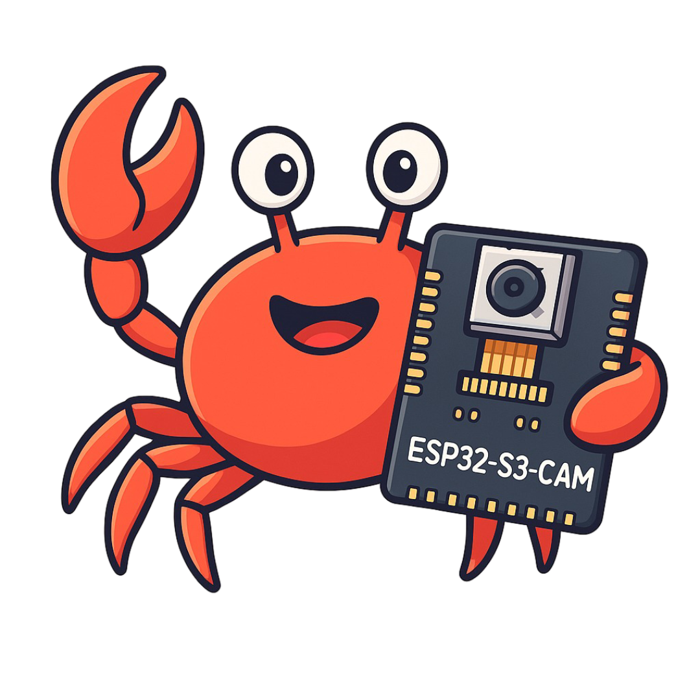

# 🦀 ESP32-S3 OV2640 Camera with Rust (customer extra esp)

<p align="center">
  
</p>

This project provides Rust bindings for the **ESP32-S3-WROOM-N16R8** with the **OV2640 camera** using [bindgen](https://rust-lang.github.io/rust-bindgen/) and [esp-idf](https://github.com/esp-rs/esp-idf).

It allows you to initialize the OV2640 camera and capture frames directly in Rust.

---

## 📦 Getting Started

### 1. Clone with Submodules
```bash
git clone https://github.com/lidm0707/ESP32-S3-WROOM-N16R8-OV2640-by-RUST-bindgen-C-.git
cd ESP32-S3-WROOM-N16R8-OV2640-by-RUST-bindgen-C-
git submodule update --init
```

### 2. Run Example
```bash
cargo run --example test_camera --release
```

📚 Library Usage
```TOML
[dependencies]
esp_cam = { git = "https://github.com/lidm0707/ESP32-S3-WROOM-N16R8-OV2640-by-RUST-bindgen-C-", branch = "main" }
```

Example: test_camera.rs
```bash
use esp_cam::espcam::Camera;
use esp_idf_hal::prelude::Peripherals;

fn main() {
    // Required patches for runtime
    esp_idf_svc::sys::link_patches();
    esp_idf_svc::log::EspLogger::initialize_default();

    log::info!("Hello, world!");
    let _peripherals = Peripherals::take().unwrap();

    // ✅ Initialize camera with fixed mapping
    let camera = Camera::default_ov2640().expect("camera init failed");

    loop {
        if let Some(framebuffer) = camera.get_framebuffer() {
            log::info!("Got framebuffer!");
            log::info!("width: {}", framebuffer.width());
            log::info!("height: {}", framebuffer.height());
            log::info!("len: {}", framebuffer.data().len());
            log::info!("format: {}", framebuffer.format());

            std::thread::sleep(std::time::Duration::from_millis(4000));
        } else {
            log::info!("no framebuffer");
        }
    }
}
```

🦀 Notes

This library is experimental and tailored for ESP32-S3 + OV2640

Uses ESP-IDF + esp-idf-hal Rust ecosystem

Make sure your ESP32-S3 toolchain and IDF are correctly installed

[Adapted from Kezii/esp32cam_rs](https://github.com/Kezii/esp32cam_rs)
